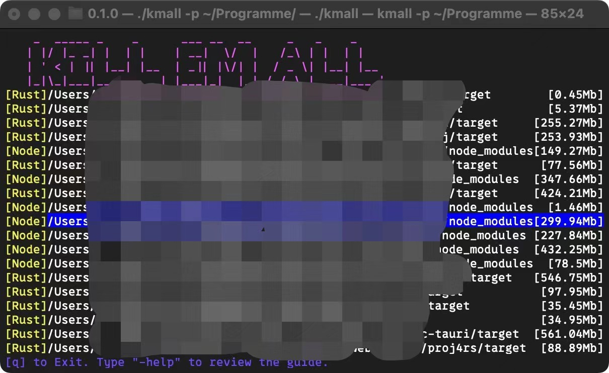
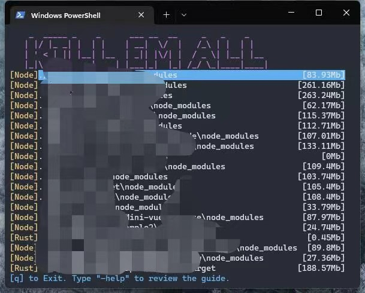

# Description

other languages: [zh-CN](./readme_zhCN.md)

A tool inspired by `npkill` that remove the dependencies or build dirs.

It can edit the rules, to ensure remove which you want to remove.




## Dev/Build

It will build the binary file for Linux and MacOS automatically. If you need to build in Windows, please build on your own.

run `cargo run` to test

run `cargo build --release` to build

## How to use

After downloading the built software. Type `kmall` will automatically initialize the config and open the software.

The config which automatically initialized will search `node_moduels` of `npm` and `target` of `Rust`. The details of the config is written at the below.

### Mode 

In `Normal Mode`, type `-` will turn into `Input Mode`. By using `Backspace` in `Input Mode` to remove all the content in the input, it will turn into `Normal Mode`

#### Normal Mode

- `j` and `ArrowDown`, `f` and `ArrowRight` will move the selected row to 1, 10 options next  respectively .
- `k` and `ArrowUp`, `k` and `ArrowLeft` will move the selected row to 1, 10 options before respectively .
- `q` to exit.
- `Space` or `Enter` will remove the selected dir. **IT WILL NOT GIVE NOTIFICATION AGAIN, PLEASE ENSURE WHAT YOU SELECTED!**

#### Input Mode

In this mode, after input the command, by type `click` will execute the command. 

- `-help` to get the easy help in the software.
- `-config` to open the dir of the config with explorer/finder.
- `-open` to open the selected dir with explorer/finder.

### Parameters

- `-p <path>` The path where begin to search. Please note that if the path contains more than one dir, it will use multi-threads to search the file. The default of the value is `./`.

### Config

`config.yaml`
```yaml
includes:
- target: node_modules
  contains_files_dirs:
  - package.json
  excludes_files_dirs: []
  prefix: '[Node]'
- target: target
  contains_files_dirs:
  - Cargo.toml
  excludes_files_dirs: []
  prefix: '[Rust]'
shallow:
- node_modules
```

- `includes` is the rules of seach files.
    - `target` the target dirname (IT IS A DIR NOT FILE!)
    - `contains_files_dirs` The parent of the target dir, should contains ALL of the files or dirs in this param, else it is not a valid target.
    - `excludes_file_dirs` The parent of the target dir, should NOT contains any of the files or dirs in this param, else it is not a valid target. Test it:
        1. edit the `excludes_files_dirs: []` to `excludes_files_dirs: [".killignore"]` where the `target` is `node_moduels`
        2. run `bash example.sh`(used `pnpm`, please edit it if you are using another)
        3. can find that `test_npm/ignore` is not a valid target.
    - `Prefix` The prefix of the valid targets. It will show at the front of the option.
- `shallow`. The dir name that will not search its children dirs. For example, there are many embeded `node_modules` in `node_modules`. It will cost much time.