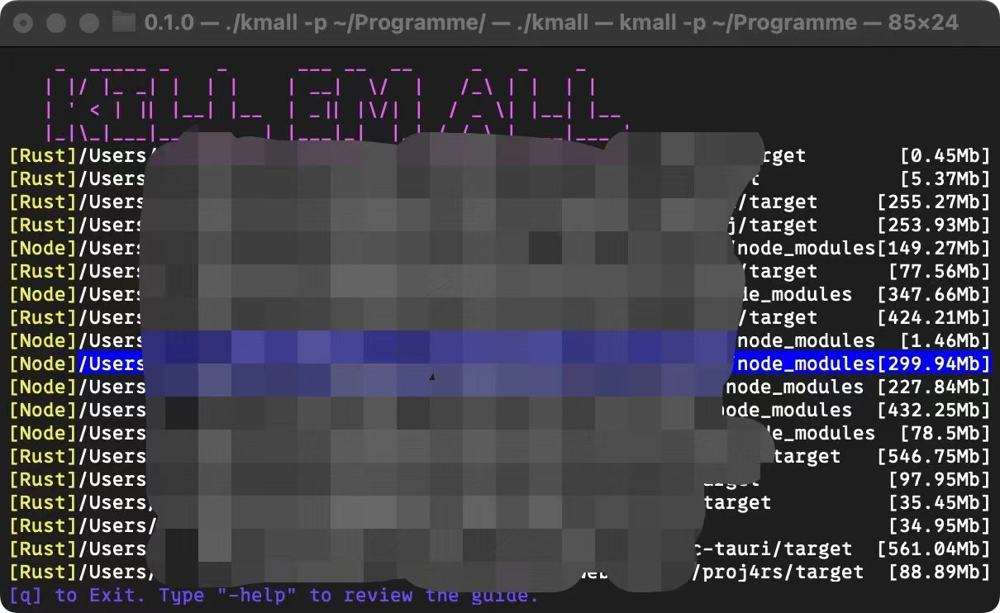
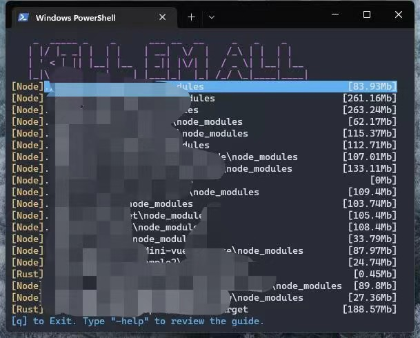

# 说明

一款受`npkill`启发的清理构建或依赖的小工具。

可以自定义规则，确保找到需要的文件。




## Dev/构建

将自动为Linux和MacOS构建二进制文件。如果您需要在Windows中进行构建，请自行构建。

使用`cargo run`即可测试

使用`cargo build --release`即可构建


## 使用

下载构建好的软件后，输入`kmall`即可自动生成配置文件并打开。
自动生成的配置文件会搜索`npm`的`node_modules`和`Rust`的`target`。配置文件在软件所在的目录下。说明下方会说明配置项。

### 模式

在普通模式下，输入`-`即可进入输入模式。把输入框的内容(使用`backspace`键)清除即可回到普通模式。

#### 普通模式

- 类似于传统的键位。`j`和`上`,`k`和`下`, 可以分别上、下移动1项。`f`和`右`, `b`和`左`，可以分别上下移动10项。
- 点击`q`即可退出
- `空格键`和`回车键`都可以删除选中项目。不会有再次提示，请删除前再三确认。

#### 输入模式

输入命令后回车即可执行命令。输入框的内容(使用`backspace`键)可以清除输入的内容。

- 输入`-help`可以查看键位的简单提示
- 输入`-config`使用资源管理器打开本软件配置所在位置
- 输入`-open`使用资源管理器打开选中项所在位置

### 参数

- `-p <地址>`开始搜索文件的地址。注意，这个地址下最好包含比较多的文件夹，这样会使用多线程进行搜索。若不指定，会在`./`开始，即是终端的目前的地址。

### 配置

`config.yaml`
```yaml
includes:
- target: node_modules
  contains_files_dirs:
  - package.json
  excludes_files_dirs: []
  prefix: '[Node]'
- target: target
  contains_files_dirs:
  - Cargo.toml
  excludes_files_dirs: []
  prefix: '[Rust]'
shallow:
- node_modules
```

- `includes`下为搜索规则。
    - `target`为目标文件夹(注意，它只可以是文件夹)。
    - `contains_files_dirs`为包含目标文件夹的文件夹中，还必须包含其他的文件或文件夹。一旦在于这个文件夹中，其中某个文件/文件夹不存，就不会认为是有效的目标。
    - `excludes_files_dirs`为包含目标文件夹的文件夹中，必须不包含任意其中一个文件或文件夹。一旦在这个文件夹中，存在其中一个这样的文件，就不会认为是有效的目标。尝试:
        1. 修改的`target`为`node_modules`一项的`excludes_files_dirs: []`为`excludes_files_dirs: [".killignore"]`
        2. 运行`bash example.sh`(使用了`pnpm`，请自行修改)
        3. 会发现`test_npm/ignore`被认为是无效目标，所以不会出现在列表中
    - `prefix`搜索到的文件的选项的前缀。请勿使用emoji，当列过小时，使用emoji会出错。
- `shallow`下为跳过向文件夹内部遍历的文件夹名。因为`node_modules`下各个库还会有`node_modules`，会大量浪费性能。


